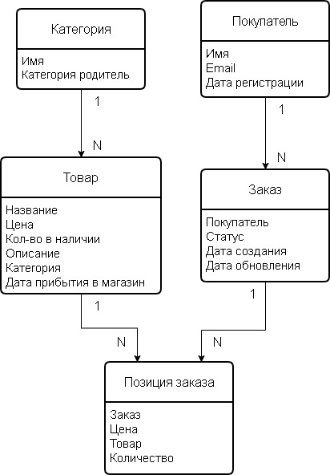
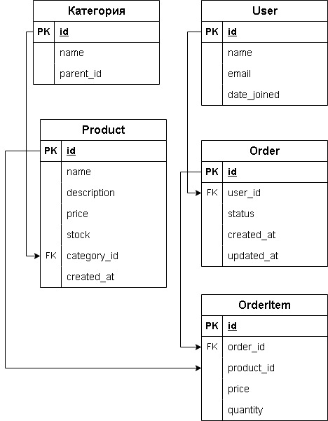

МИНИСТЕРСТВО ОБРАЗОВАНИЯ И НАУКИ РОССИЙСКОЙ ФЕДЕРАЦИИ УФИМСКИЙ УНИВЕРСИТЕТ НАУК И ТЕХНОЛОГИЙ ИНСТИТУТ ИНФОРМАТИКИ, МАТЕМАТИКИ И РОБОТОТЕХНИКИ

Реферат

По дисциплине «Администрирование информационных систем»

По теме «Проектирование реляционных баз данных: от концептуальной модели до физической реализации с помощью ORM.»

Выполнил: студент группы ПРО-439Б

Шамсутдинов А. Н.

Проверил:

Чернышев Е. С.

**Уфа 2025**

[Введение	3](#_toc16372)

[1. Проектирование реляционных баз данных	4](#_toc18007)

[1.1. Концептуальное моделирование	7](#_toc31734)

[1.2. Логическое проектирование	11](#_toc8371)

[1.3. Физическое проектирование	16](#_toc16862)

[1.4. Реализация модели данных с помощью ORM	23](#_toc20394)

[Приложение	26](#_toc13327)

# **Введение**
Реляционные базы данных остаются основой хранения структурированных данных в информационных системах. Для обеспечения надежности, согласованности и производительности важен тщательно спроектированный процесс разработки - от концептуального моделирования до физической реализации. В современных программных проектах ключевым элементом этого процесса является использование ORM-технологий (Object–Relational Mapping), позволяющих разработчикам работать с данными на уровне объектно-ориентированных моделей без прямого обращения к SQL.

В условиях стремительно развивающихся информационных систем и увеличивающейся сложности программных продуктов использование технологий ORM (Object–Relational Mapping) становится всё более актуальным. Это связано со следующими тенденциями в разработке программного обеспечения и управления данными: рост сложности приложений и объёма данных; высокие требования и короткие релизные циклы; работа с разными СУБД; высокие требования к безопасности и устойчивости к ошибкам; высокие к требования читабельности, структурированности и сопровождаемости кода; требования к поддержке современных архитектур (микросервисы и DDD); требования к наличию широкой экосистемы и инструментальной поддержки.

Настоящий реферат рассматривает основные этапы проектирования реляционных БД и способы реализации моделей данных с помощью ORM.

**Цель**: рассмотреть проектирование реляционной базы данных поэтапно и разобрать на примере.

**Задачи**: описать каждый этап проектирования реляционной базы данных, спроектировать базу данных на любов примере, получить работающий код для приведенного примера.
1. # **Проектирование реляционных баз данных**
Проектирование реляционных баз данных - это процесс создания структурированной модели хранения данных, обеспечивающей их целостность, удобство использования и эффективную обработку. Оно необходимо для построения надёжных информационных систем и включает ряд последовательных этапов:

1. Анализ требований и предметной области

Проектирование начинается с изучения задач, которые должна решать система:

- какие данные нужно хранить,
- какие процессы с ними выполняются,
- какие пользователи и сценарии работы существуют.

В результате формируется представление о сущностях предметной области и связях между ними.

2. Концептуальное моделирование

На этом этапе создаётся абстрактная модель данных, не привязанная к конкретной СУБД.

Основной инструмент - ER-модель (Entity–Relationship), которая включает:

- сущности (объекты предметной области),
- атрибуты (их свойства),
- связи (тип взаимодействия сущностей: 1:1, 1:N, M:N).

Цель концептуальной модели - чётко и наглядно представить структуру будущей базы данных.

3. Логическое проектирование

Логическая модель преобразует концептуальную схему в реляционную структуру:

- создаются таблицы,
- определяются атрибуты и домены (типы данных),
- выделяются ключи (первичные и внешние),
- проектируются связи между таблицами.

На этом этапе применяется нормализация - правила преобразования структуры для устранения избыточности и логических аномалий. Обычно стремятся к достижению 3-й нормальной формы.

4. Физическое проектирование

Физическая модель описывает уже конкретную реализацию базы данных в выбранной СУБД (PostgreSQL, MySQL, Oracle и др.). Сюда относится:

- выбор типов данных с учётом особенностей СУБД,
- создание индексов,
- настройка ограничений целостности (PRIMARY KEY, UNIQUE, CHECK, FOREIGN KEY),
- оптимизация структуры под конкретные рабочие нагрузки,
- выбор способов хранения и партиционирования.

Задача этапа - обеспечить производительность, надёжность и масштабируемость системы.

5. Реализация моделей данных с помощью ORM

После того как структура базы данных определена, она интегрируется в программное приложение. Для этого современные разработчики часто используют ORM (Object-Relational Mapping) - технологию отображения таблиц на объектные классы языка программирования.

Основные задачи ORM на этапе реализации:

- создание объектных моделей, соответствующих таблицам БД;
- автоматическая генерация и управление миграциями схемы;
- упрощение CRUD-операций (создание, чтение, обновление, удаление);
- обеспечение безопасности запросов (защита от SQL-инъекций);
- поддержка связей (One-to-One, One-to-Many, Many-to-Many) на объектном уровне.
6. Эксплуатация и сопровождение

После создания базы данных и подключения её к приложению выполняются:

- наполнение начальными данными,
- мониторинг производительности,
- обновление структуры через миграции ORM или SQL,
- настройка резервного копирования,
- обеспечение безопасности.

Этот этап продолжается на протяжении всего жизненного цикла системы.

Из вышеперечисленных этапов, в данной работе будут рассмотрены все кроме первого и последнего. Анализ требований и предметной области, а также этап эксплуатации и сопровождения - обширные тему, требующие отдельного рассмотрения. В данной работе приоритет отдан рассмотрению этапов проектирования и создания реляционной базы данных, независящих от какой-либо предметной области, исключая дальнейшие этапы жизненного цикла базы данных. 

Далее рассмотрим первый (интересующий для нас) этап проектирование базы данных - концептуальное моделирование.
## **1.1. Концептуальное моделирование**
Концептуальное моделирование - это начальный и один из наиболее важных этапов проектирования реляционной базы данных. Его задача - сформировать абстрактное, независимое от технологий и конкретных СУБД представление о данных предметной области. На этом уровне определяются ключевые сущности, их свойства и взаимосвязи, которые затем станут основой для логического и физического проектирования.

Концептуальная модель создаётся с несколькими важными целями:

- Формализация знаний о предметной области - разработчики, аналитики и заказчики получают общее представление о структуре данных и бизнес-процессах.
- Выделение сущностей и связей - определяются объекты, которые должны быть представлены в базе данных, и устанавливаются их отношения.
- Устранение неоднозначностей - концептуальная модель помогает выявлять противоречия в требованиях и устранять различное понимание терминов.
- Создание основы для последующих этапов - от качества концептуальной схемы зависит корректность логической модели и, следовательно, всей базы данных.

	Концептуальная модель представляет данные в виде объектов и их отношений. Наиболее распространённым способом является ER-модель (Entity-Relationship). 

ER-модель включает следующие составляющие:

- Сущности (Entity) - это основные объекты предметной области то, что необходимо хранить в базе. Примеры: Пользователь, Заказ, Продукт, Организация. Сущность описывается набором атрибутов.
- Атрибуты (Attributes) - это свойства сущности. Например для сущности Пользователь: имя, email, дата регистрации. Атрибуты могут быть: простыми или составными, обязательными или необязательными, уникальными или повторяющимися.
- Связи (Relationship) - определяют, как сущности взаимодействуют друг с другом. Основные типы:
  - 1:1 (один к одному) - один сотрудник имеет один паспорт;
  - 1:N (один ко многим) - один пользователь может делать много заказов;
  - M:N (многие ко многим) - студенты посещают множество курсов, и каждый курс посещают многие студенты.

Связи могут иметь свои атрибуты, особенно если это связь типа M:N.

Концептуальная модель зачастую составляется графически, используя существующие методологии и нотации. Наиболее часто-используемые нотации для концептуального моделирования:

- ER-диаграммы (Чен, UML Class Diagram) - самый популярный способ визуализации концептуальной модели. Используются графические элементы:
  - прямоугольники для сущностей,
  - овалы для атрибутов,
  - ромбы или связи-стрелки для отношений.
- IDEF1X - более строгая нотация, часто применяемая в крупных корпоративных проектах и государственных системах.
- UML (Unified Modeling Language). Хотя UML предназначен для моделирования ПО в целом, диаграммы классов часто используются и для моделирования данных.

Создание концептуальной модели включает следующие этапы:

1) Сбор и анализ требований. Аналитики получают информацию от заказчиков, будущих пользователей, документации.
2) Выделение сущностей. Определяются ключевые объекты, которые должны попадать в систему.
3) Определение атрибутов. Выявляются свойства сущностей.
4) Определение связей. Устанавливаются отношения между объектами.
5) Уточнение ограничений. Определяются: обязательные атрибуты, уникальные значения, правила владения данными, бизнес-ограничения.
6) Валидация модели. Проверка модели: на корректность, полноту, отсутствие противоречий, соответствие требованиям. Обычно проводится обсуждение между аналитиками, архитекторами и заказчиком.

Рассмотрим пример концептуальной модели, который уже затрагивался выше. Рассмотрим основные данные, которыми манипулирует магазин: покупатели, товары и заказы. Выделим интересующие нас сущности.

Сущности:

- User - покупатель
- Category - категория товара
- Product - товар
- Order - заказ
- OrderItem - позиция заказа

	Теперь определим, какие свойства нас интересуют у выделенных сущностей.

	Атрибуты:

- Покупатель: имя, email, дата регистрации;
- Категория товара: имя, категория родитель (для построение иерархии категорий);
- Товар: название, цена, кол-во в наличии, описание, категория, дата прибытия в магазин;
- Заказ: покупатель, статус, дата создания, дата обновления;
- Позиция заказа: заказ, товар, цена, количество.

	Затем определим связи, проглядывающие, между сущностями.

Связи:

- Category 1 - N Product
- User 1 - N Order
- Order 1 - N OrderItem
- Product 1 - N OrderItem

Таким образом получаем схему сущностей показанную на рисунке 1.

Рисунок 1 - схема логической модели

базы данных интернет-магазина

На этом разработка концептуальной модели в нашем примере заканчивается. Следует понимать, что данный пример концептуальной модели не позволит нам разработать базу данных для реального использования, так как в реальности нам потребуется учитывать намного больше сущностей и их свойств, для корректного функционирования интернет-магазина, однако, ка пример поможет нам понять суть концептуального проектирования.
## **1.2. Логическое проектирование**
Логическое проектирование реляционных баз данных - это этап разработки БД, на котором создаётся логическая модель данных, независимая от конкретной СУБД, но отражающая нужды предметной области и обеспечивающая корректность, непротиворечивость и эффективность хранения данных.

На этом этапе решают:

- какие таблицы будут в базе,
- какие атрибуты будут в каждой таблице,
- какие связи между таблицами,
- какие ограничения целостности нужны,
- в каких нормальных формах должны быть таблицы.

	Основные шаги логического проектирования:

1. Преобразование сущностей в таблицы

Каждая сущность становится таблицей.

2. Определение первичных ключей

Каждая таблица должна иметь уникальный идентификатор:

- искусственный ключ (например, ID),
- естественный ключ (например, серийный номер, email).
3. Преобразование связей
- Связь 1:1 обычно реализуется через внешний ключ (одна таблица получает ссылку на другую).
- Для Связи 1:N в таблице со стороны «многие» добавляется внешний ключ, который указывает на сторону «один».
- Связь M:N преобразуется в промежуточную таблицу, содержащую два внешних ключа.
4. Определение атрибутов

Для каждого атрибута выбираются:

- тип данных,
- обязательность (NOT NULL),
- уникальность,
- форматы,
- ограничения проверок (CHECK).
5. Нормализация

Организация структуры так, чтобы:

- не было избыточности,
- не было аномалий обновления, вставки, удаления,
- зависимости атрибутов были корректными.

Обычно доводят модель до третьей нормальной формы (3НФ) или BCNF.

6. Определение ограничений целостности

Решается, какие правила должны соблюдаться в БД.

Типы ограничений:

- Сущностная целостность (PRIMARY KEY, UNIQUE)
- Ссылочная целостность (FOREIGN KEY)
- Доменная целостность (CHECK, типы)
- Бизнес-правила (например, зарплата ≥ 0)
7. Оптимизация логической схемы

На основе ожидаемой нагрузки:

- корректируют индексы,
- рассматривают денормализацию,
- выбирают способы хранения связей,
- анализируют частые запросы.

	Продолжим проектирование базы данных для нашего примера - интернет-магазина. Логическая модель состоит из 5 таблиц по 5 сущностям обозначенным в примере в разделе 1.2. Опишем какой тип имеют поля сущностей и манимальный набор ограничений.

Таблица 1.2.1: Покупатель

|Свойства|Тип|Ограничения|
| :-: | :-: | :-: |
|ФИО|текст|уникальное|
|Email|текст|уникальное|
|Дата регистрации|дата|Не пустая|

Таблица 1.2.2: Категория

|Поле|Тип|Ограничения|
| :-: | :-: | :-: |
|Название|текст|уникальное|
|Категория-родитель|Категория|может отсутствовать|

Таблица 1.2.3: Товар

|Поле|Тип|Ограничения|
| :-: | :-: | :-: |
|Название|текст|не пустое|
|Цена|числовое|не пустое|
|Кол-во в наличии|числовое|не  пустое|
|описание|текст|может отсутствовать|
|Категория|Категория|не пустое|
|Дата прибытия|дата|не пустое|

Таблица 1.2.4: Заказ

|Поле|Тип|Ограничения|
| :-: | :-: | :-: |
|Покупатель|Покупатель|не пустое|
|Статус|текст|не пустое|
|Дата создания|дата|не пустое|
|Дата обновления|дата|может отсутствовать|

Таблица 1.2.5: Позиция заказа

|Поле|Тип|Ограничения|
| :-: | :-: | :-: |
|Заказ|Заказ|не пустое|
|Товар|Товар|не пустое|
|Цена|числовое|не пустое|
|Количество|числовое|не пустое|

Как можно заметить в таблице 1.2.5 используется поле «Цена», хотя такое поле уже есть у сущности «Товар», которая также включается как поле этой же таблицы. Причина такого решения в том, что цена на товары могут меняться, однако, цена уже купленного товара, хранящегося в таблице с позициями товаров в заказе, - не должна.
## **1.3. Физическое проектирование**
Физическое проектирование реляционных баз данных - это этап, на котором логическая модель преобразуется в конкретную структуру хранения данных в выбранной СУБД с учётом производительности, объёмов данных, требований к отказоустойчивости и особенностей конкретной платформы (PostgreSQL, MySQL, Oracle, SQL Server и др.).

Цели физического проектирования:

- Повышение производительности запросов
- Минимизация затрат на хранение
- Обеспечение надёжности и отказоустойчивости
- Оптимизация работы под реальные нагрузки
- Настройка файлов, таблиц, индексов, буферов, распределения по дискам

Физическое проектирование включает следующие шаги:

1) Выбор СУБД и её параметров

На этом этапе определяется:

- тип СУБД (PostgreSQL, MySQL, Oracle, MS SQL Server, SQLite),
- версия,
- параметры конфигурации (буферы, кеши, лимиты памяти),
- способы репликации, доступности, резервного копирования.
2) Оптимизация структуры таблиц

В отличие от логического уровня, здесь важно:

- выбрать типы данных с учётом точного использования (например INT vs SMALLINT, VARCHAR(50) vs TEXT),
- определить физическую организацию таблиц (например, heap-таблицы в Postgres, clustered index в MS SQL),
- расставить ограничения, индексы, триггеры.
2) Проектирование индексов

Индексы - ключевой элемент физического проектирования.

На этом этапе решается:

- какие индексы нужны для ускорения выборок,
- где индекс не нужен (потому что замедлит вставки),
- тип индекса:
  - B-Tree (по умолчанию),
  - Hash,
  - GiST,
  - GIN (для полнотекстового поиска),
  - BRIN (для очень больших таблиц с упорядоченными данными).

Также на этом этапе прорабатываются:

- покрывающие индексы,
- составные индексы,
- уникальные индексы,
- индексы частичных данных.
3) Определение способов хранения данных

На этом этапе могут выполнятся следующие действия в зависимости от СУБД:

- размещение таблиц в отдельных файлах,
- вынесение больших полей (BLOB/CLOB) в отдельные сегменты,
- определение механизмов хранения NULL-значений,
- включение или выключение сжатия.

В Oracle, например, тонко настраиваются tablespaces, extents, segments.

В PostgreSQL - настройки fillfactor, TOAST-хранение, autovacuum.

4) Размещение объектов по дискам и разделам

При больших нагрузках выполняется следующее:

- логи транзакций выносят на быстрые SSD,
- индексы и таблицы выносятся на разные хранилища,
- архивные данные выносятся на дешёвые диски,
- распараллеливают файлы по файловым группам (SQL Server) или tablespaces (Oracle/PostgreSQL).
5) Распределение данных

Если объёмы данных - огромные, то выполняют:

- горизонтальное партиционирование (по датам, диапазонам, хешам),
- вертикальное партиционирование (вынос редко используемых столбцов),
- шардирование (распределение по нескольким серверам).
6) Настройка транзакционности и журналирования

На этом этапе определяются:

- уровень изоляции транзакций,
- использование WAL / REDO / UNDO журналов,
- стратегии checkpoint,
- параметры autovacuum (PostgreSQL).
7) Оптимизация для типов нагрузки

Для OLTP (транзакционная) нагрузки:

- компактные индексы,
- минимальные задержки,
- конфигурация под массовые короткие запросы.

Для OLAP (аналитика) нагрузки:

- колоночное хранение (если доступно),
- крупные партиции,
- денормализация,
- материализованные представления.

Теперь рассмотрим физическое проектирование на примере интернет-магазина. В разделе 1.3 мы составили таблицы для каждой сущности. Теперь конкретезируем эти таблицы, а затем опишем SQL-код для их создания.

Таблица 1.3.1: Покупатель (User)

|Поле|Тип|Ограничения|
| :-: | :-: | :-: |
|id|PK|serial|
|username|varchar(255)|unique|
|email|varchar(255)|unique|
|date\_joined|datetime|not null|

Таблица 1.3.2: Категория (Category)

|Поле|Тип|Ограничения|
| :-: | :-: | :-: |
|id|PK|serial|
|name|varchar(255)|unique|
|parent\_id|FK(Category)|nullable (иерархия категорий)|

Таблица 1.3.3: Товар (Product)

|Поле|Тип|Ограничения|
| :-: | :-: | :-: |
|id|PK|serial|
|name|varchar(255)|not null|
|price|numeric(10,2)|not null|
|stock|int|not null|
|description|text|nullable|
|category\_id|FK(Category)|not null|
|created\_at|datetime|not null|

Таблица 1.3.4: Заказ (Order)

|Поле|Тип|Ограничения|
| :-: | :-: | :-: |
|id|PK|serial|
|user\_id|FK(User)|not null|
|status|varchar(255)|not null|
|created\_at|datetime|not null|
|updated\_at|datetime|nullable|

Таблица 1.3.5: Позиция в заказе (OrderItem)

|Поле|Тип|Ограничения|
| :-: | :-: | :-: |
|id|PK|serial|
|order\_id|FK(Order)|not null|
|product\_id|FK(Product)|not null|
|price|numeric(10, 2)|not null|
|quantity|int|not null|

Как можно увидеть в таблицах 1.3.1 - 1.3.5, мы используем поле «id» типа «PK» с ограничением «serial» в качестве ключа, что означает, что мы полагаемся на СУБД в генерации ключей как последовательных целых чисел.

Схему физической можели можно увидель на рисунке 2.

Рисунок 2 - схема физической модели 

базы данных интернет-магазина

Кроме всего прочего, на этом этапе нам нужно включить индексы, ограничения связи и прочие ограничения, интересующих нас сущностей. Начнем с индексов.

Имеет смысл включить следующие индексы, для ускорения поиска по таблицам:

- Индексы по ключам таблиц (User.id, Category.id, Product.id, Order.id, OrderItem.id). Такие индексы обычно автоматически генерируются СУБД.
- Индекс по категории продукта (Product.categoty\_id)
- Индекс по позиции в заказе (составной индекс из полей OrderItem.order\_id, OrderItem.product\_id)
- Индекс по цене товара (Product.price)
- Индекс по категории товара (Product.category)
- Индекс для подкатегорий категорий (Category.parent\_id)
- Индекс для покупателя в заказах (Order.user\_id)
- Индекс по статусу заказа (Order.status)

Все связи у нас являются каскадными, то есть при удалении из одной записи, все записи ссылающиеся на удаляемую запись из других сущностей будут также стираться.

Также стоит ограничить количество товаров в позиции заказа быть больше 0 (т. е.  OrderItem.quantity > 0), цена товара была больше или равна 0 (в случае акций может быть 0, Product.price >= 0), количество товара на складе больше или равно 0 (Product.stock >= 0). 

SQL код для создания всех таблиц, индексов и ограничений приведен в приложении. Однако стоит помнить, что при использовании ORM, SQL код по созданию таблиц генерируется фреймворком автоматически, а потому нужды писать этот код самостоятельно нет.
## **1.4. Реализация модели данных с помощью ORM**
Реализация модели данных с помощью ORM (Object–Relational Mapping) - это способ связать объектно-ориентированный код приложения с реляционной базой данных так, чтобы программист работал не с SQL, а с объектами и классами. ORM автоматически преобразует объекты в записи таблиц, а запросы - в SQL.

ORM позволяет:

- описывать таблицы БД как классы;
- строки таблиц - как объекты этих классов;
- связи между таблицами - как атрибуты (OneToMany, ManyToMany и т. д.);
- выполнять запросы к базе - через метод вызова, а не SQL-строки;
- автоматически создавать и мигрировать структуру БД.

ORM технологии автоматически генерируют SQL-код так, что необходимость писать SQL-запросы вручную практически отпадает. Причем ORM позволяют использовать и чистый SQL код при необходимости.

Рассмотрим достоинства и недостатки ORM-технологий.

Достоинства:

- Скорость разработки - не нужно писать SQL для простых операций.
- Модель как часть кода - все сущности описаны прямо в коде приложения.
- Безопасность - ORM предотвращает SQL-инъекции, используя параметризацию.
- Портируемость - можно сменить СУБД, почти не меняя код (хотя не всегда легко).
- Работа с данными как с объектами - особенно полезно в OO-приложениях.

Недостатки:

- Потенциальная потеря производительности - особенно заметна при неявных JOIN или N+1 запросах, а также ORM абстрагирует SQL, но это может скрывать важные детали оптимизации.
- Недостаток гибкости - при очень сложных запросах проще и быстрее использовать «сырой» SQL.
- Невозможность полной настройки - ORM за абстракцией скрывает некоторые особые возможности конкретных экземпляров СУБД и их не получается использовать без «сырого» SQL кода.

Код для django для примера интернет-магазина приведен в приложении.
# **Вывод**
В данной работе мы рассмотрели процесс проектирования модели реляционной базы данных по всем этапам - от концептуального до физической реализации с помощью ORM. Разобрали каждый этап на примере интернет-магазина. А также написали работающий код реализации этой базы данных. В заключение хочется сказать, что проектирование и создание базы данных - это не легкий процесс, еще сложнее процесс интеграции этой базы данных с кодом приложения, потому так важны инструменты облегчающие этот процесс. ORM технологии - это яркий пример таких инструментов. Их использование сильно облегчает работу разработчикам, пусть эти инструменты и не лишены недостатков.
# **Список литературы**
1. Бондаренко М. М. Проектирование баз данных: учебное пособие. - Ростов н/Д: Феникс, 2018. - 256 с.
2. Завьялов А. Н., Кудрявцев В. Б. Системы баз данных: учебник для вузов. - М.: КноРус, 2021. - 432 с.
3. Санников С. К. Базы данных. Проектирование: учебное пособие для вузов. - М.: ФОРУМ, 2019. - 304 с.
4. Кабанов В. В. Проектирование баз данных: учебное пособие. - М.: ИНФРА-М, 2017. - 224 с.
5. Кузьмин Г. М., Бабич С. П. Базы данных: учебник. - М.: Академия, 2020. - 384 с.
6. Меликсетян З. А. Базы данных и информационные системы: учебник для вузов. - СПб.: Питер, 2019. - 592 с.
7. Соловьёв В. А., Липунцов А. В. Проектирование информационных систем и баз данных: учебное пособие. - М.: Лань, 2020. - 320 с.
8. Головастиков А. И. Реляционные базы данных: теория и разработка: учебное пособие. - Екатеринбург: УрФУ, 2018. - 198 с.
9. Стефанюк Е. Н. Базы данных: проектирование, реализация, управление. Учебное пособие. - СПб.: БХВ-Петербург, 2016. - 432 с.
10. Шапошников С. А. Модели данных и проектиование баз данных: учебное пособие. - М.: МИЭТ, 2015. - 180 с.
# **Приложение**
SQL код для раздела 1.3:

*-- ============================*

*-- 1. Таблица Category*

*-- ============================*

    *CREATE TABLE category (*

    *id SERIAL PRIMARY KEY,*

    *name VARCHAR(255) UNIQUE NOT NULL,*

    *parent\_id INTEGER REFERENCES category(id) ON DELETE SET NULL*

    *);*

*-- Индекс для ускорения выборок подкатегорий*

*CREATE INDEX idx\_category\_parent\_id ON category(parent\_id);*

*-- ============================*

*-- 2. Таблица Product*

*-- ============================*

*CREATE TABLE product (*

*id SERIAL PRIMARY KEY,*

*name VARCHAR(255) NOT NULL,*

*description TEXT,*

*price NUMERIC(10, 2) NOT NULL CHECK (price >= 0),*

*stock INTEGER NOT NULL CHECK (stock >= 0),*

*category\_id INTEGER NOT NULL REFERENCES category(id) ON DELETE RESTRICT,*

*created\_at TIMESTAMP NOT NULL DEFAULT NOW()*

*);*

*-- Индекс по категории*

*CREATE INDEX idx\_product\_category ON product(category\_id);*

*-- Индекс по цене (для фильтров)*

*CREATE INDEX idx\_product\_price ON product(price);*

*-- ============================*

*-- 3. Таблица Users*

*-- ============================*

*CREATE TABLE user (*

*id SERIAL PRIMARY KEY,*

*username VARCHAR(150) UNIQUE NOT NULL,*

*email VARCHAR(255) UNIQUE NOT NULL,*

*date\_joined TIMESTAMP NOT NULL DEFAULT NOW()*

*);*

*-- ============================*

*-- 4. Таблица Order*

*-- ============================*

*CREATE TABLE "order" (*

*id SERIAL PRIMARY KEY,*

*user\_id INTEGER NOT NULL REFERENCES user(id) ON DELETE CASCADE,*

*status VARCHAR(20) NOT NULL DEFAULT 'created',*

*created\_at TIMESTAMP NOT NULL DEFAULT NOW(),*

*updated\_at TIMESTAMP NOT NULL DEFAULT NOW()*

*);*

*-- Индекс для поиска заказов пользователя*

*CREATE INDEX idx\_order\_user\_id ON "order"(user\_id);*

*-- Индекс по статусу (для фильтрации)*

*CREATE INDEX idx\_order\_status ON "order"(status);*

*-- ============================*

*-- 5. Таблица OrderItem*

*-- ============================*

*CREATE TABLE order\_item (*

*id SERIAL PRIMARY KEY,*

*order\_id INTEGER NOT NULL REFERENCES "order"(id) ON DELETE CASCADE,*

*product\_id INTEGER NOT NULL REFERENCES product(id) ON DELETE RESTRICT,*

*price NUMERIC(10,2) NOT NULL CHECK (price >= 0),*

*quantity INTEGER NOT NULL CHECK (quantity > 0)*

*);*

*-- Часто используемый составной индекс:*

*CREATE INDEX idx\_orderitem\_order\_product*

*ON order\_item(order\_id, product\_id);*

Код на Python для фреймворка django (файл models.py):

`*from django.db import models*

*from django.contrib.auth.models import User*

*class Category(models.Model):*

*name = models.CharField(max\_length=255, unique=True)*

*parent = models.ForeignKey(*

    *"self",*

    *on\_delete=models.SET\_NULL,*

    *null=True,*

    *blank=True,*

    *related\_name="subcategories"*

*)*

*def \_\_str\_\_(self):*

    *return self.name*

*class Product(models.Model):*

*name = models.CharField(max\_length=255)*

*description = models.TextField(blank=True)*

*price = models.DecimalField(max\_digits=10, decimal\_places=2)*

*stock = models.PositiveIntegerField()*

*category = models.ForeignKey(Category, on\_delete=models.PROTECT, related\_name="products")*

*created\_at = models.DateTimeField(auto\_now\_add=True)*

*def \_\_str\_\_(self):*

    *return self.name*

*class Order(models.Model):*

*STATUS\_CHOICES = [*

    *("created", "Создан"),*

    *("paid", "Оплачен"),*

    *("shipped", "Отправлен"),*

    *("completed", "Завершён"),*

    *("cancelled", "Отменён"),*

*]*

*user = models.ForeignKey(User, on\_delete=models.CASCADE, related\_name="orders")*

*status = models.CharField(max\_length=20, choices=STATUS\_CHOICES, default="created")*

*created\_at = models.DateTimeField(auto\_now\_add=True)*

*updated\_at = models.DateTimeField(auto\_now=True)*

*def \_\_str\_\_(self):*

    *return f"Order #{self.id}"*

*class OrderItem(models.Model):*

*order = models.ForeignKey(Order, on\_delete=models.CASCADE, related\_name="items")*

*product = models.ForeignKey(Product, on\_delete=models.PROTECT)*

*price = models.DecimalField(max\_digits=10, decimal\_places=2)  # фиксирует цену*

*quantity = models.PositiveIntegerField()*

*def \_\_str\_\_(self):*

    *return f"{self.product.name} × {self.quantity}"*

*class Cart(models.Model):*

*user = models.OneToOneField(User, on\_delete=models.CASCADE, related\_name="cart")*

*def \_\_str\_\_(self):*

    *return f"Cart of {self.user.username}"*

*class CartItem(models.Model):*

*cart = models.ForeignKey(Cart, on\_delete=models.CASCADE, related\_name="items")*

*product = models.ForeignKey(Product, on\_delete=models.CASCADE)*

*quantity = models.PositiveIntegerField()*

*class Meta:*

    *unique\_together = ("cart", "product")*

*def \_\_str\_\_(self):*

    *return f"{self.product.name} × {self.quantity}"*`